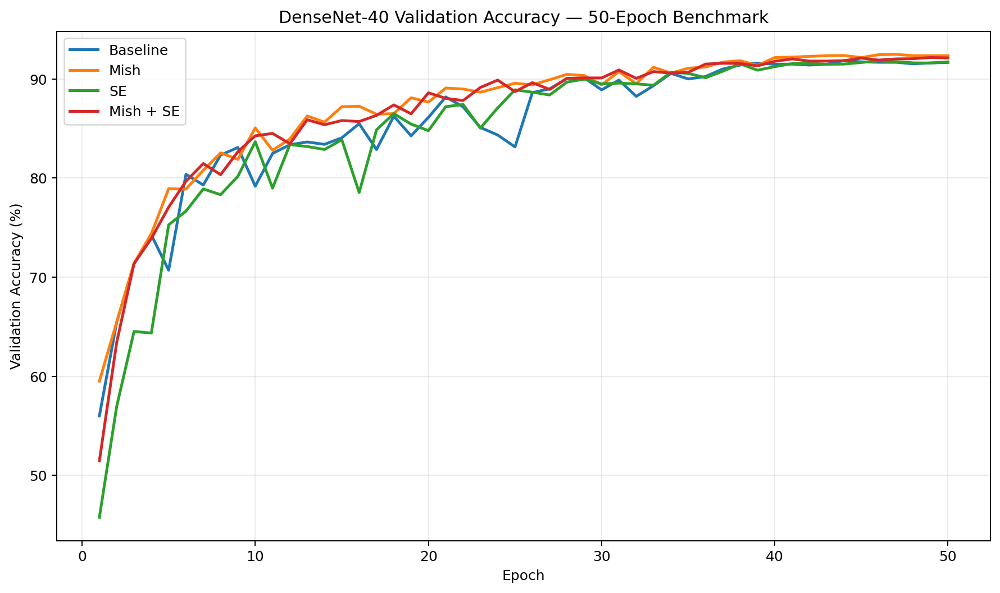
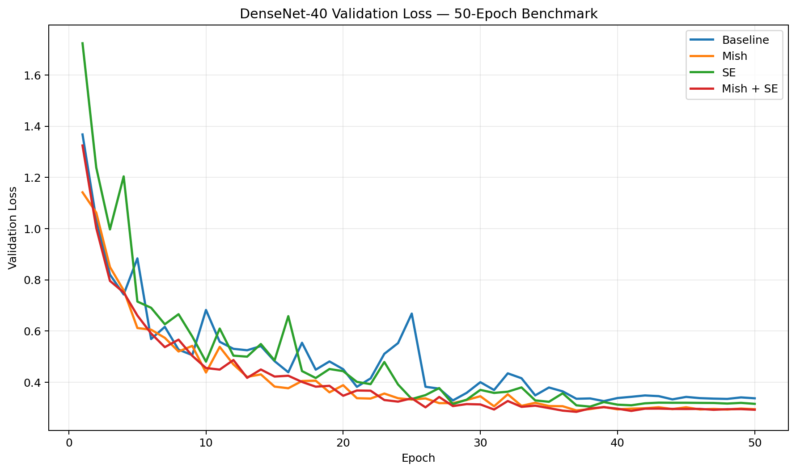
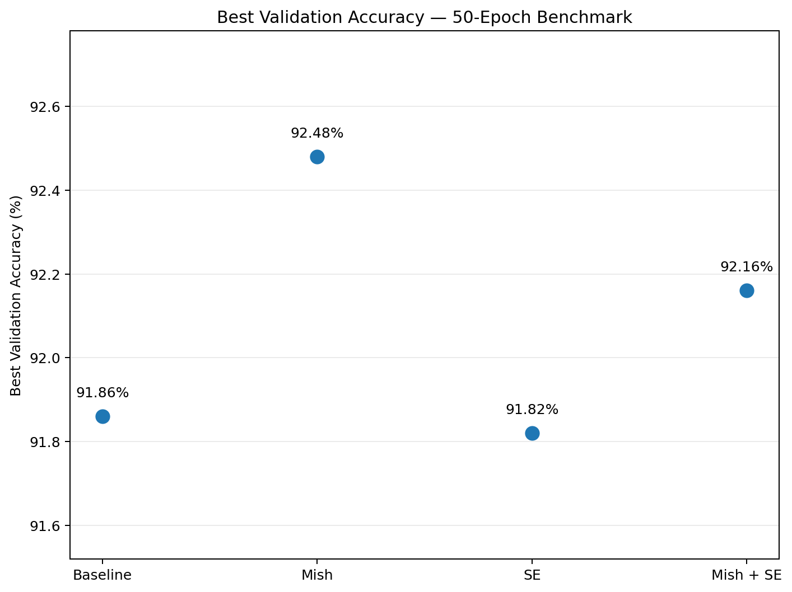
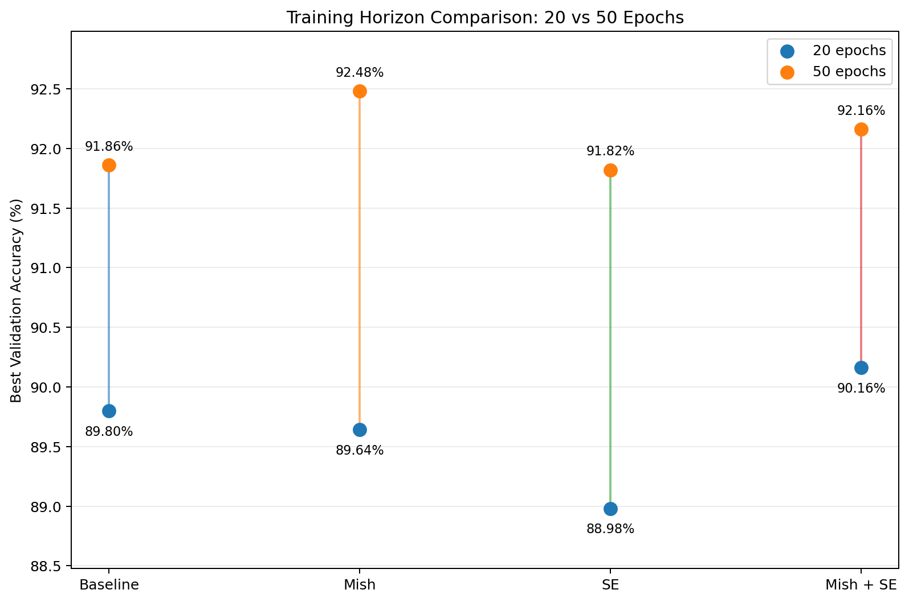
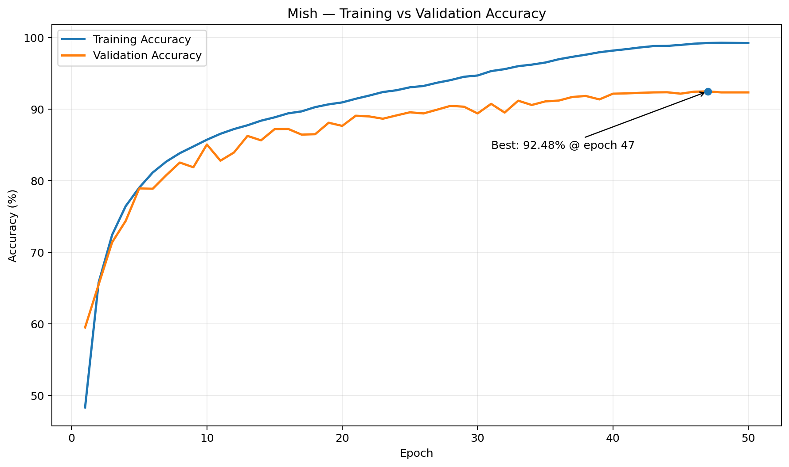

# Experimental Results

This document summarizes the completed CIFAR-10 experiments for the DenseNet-40 ablation study.

The study compares four controlled variants:

| Variant | Activation | Squeeze-and-Excitation |
| --- | --- | --- |
| Baseline | ReLU | No |
| Mish | Mish | No |
| SE | ReLU | Yes |
| Mish + SE | Mish | Yes |

All variants use the same DenseNet-40 architecture, CIFAR-10 train/validation split, optimizer configuration, scheduler family, and random seed. Only the activation function and the use of Squeeze-and-Excitation differ between variants.

The experiments reported here use seed 42. Therefore, small differences should be interpreted as results from this controlled single-seed benchmark rather than statistical evidence of universal superiority.

## 1. 20-Epoch Pilot

The initial pilot trained each variant for 20 epochs. Its purpose was to validate the experimental pipeline, estimate runtime, and obtain an early comparison before running the longer benchmark.

| Variant | Parameters | Best Epoch | Best Validation Accuracy | Delta vs Baseline | Final Validation Accuracy | Runtime |
| --- | ---: | ---: | ---: | ---: | ---: | ---: |
| Baseline | 1,019,722 | 19 | 89.80% | — | 89.70% | 33.16 min |
| Mish | 1,019,722 | 19 | 89.64% | -0.16 pp | 89.56% | 39.63 min |
| SE | 1,060,531 | 17 | 88.98% | -0.82 pp | 88.90% | 34.85 min |
| Mish + SE | 1,060,531 | 19 | **90.16%** | **+0.36 pp** | 90.08% | 36.64 min |

At 20 epochs, Mish and SE individually did not outperform the ReLU baseline. However, the combined Mish + SE model achieved the highest validation accuracy at 90.16%, exceeding the baseline by 0.36 percentage points.

This was treated as a preliminary signal only. The pilot did not establish that Mish + SE was generally better, because the training horizon was short and only one random seed was used.

## 2. 50-Epoch Extended Benchmark

The main portfolio benchmark trained the same four variants for 50 epochs using the same seed and experimental conditions.

| Variant | Parameters | Best Epoch | Best Validation Accuracy | Delta vs Baseline | Final Validation Accuracy | Runtime |
| --- | ---: | ---: | ---: | ---: | ---: | ---: |
| Baseline | 1,019,722 | 44 | 91.86% | — | 91.66% | 86.77 min |
| Mish | 1,019,722 | 47 | **92.48%** | **+0.62 pp** | **92.34%** | 92.40 min |
| SE | 1,060,531 | 46 | 91.82% | -0.04 pp | 91.72% | 97.41 min |
| Mish + SE | 1,060,531 | 49 | 92.16% | +0.30 pp | 92.12% | 104.41 min |

Mish produced the highest validation accuracy in the 50-epoch benchmark, reaching 92.48% at epoch 47. This is a 0.62 percentage-point improvement over the ReLU baseline without increasing the model parameter count.

The SE-only variant achieved 91.82%, effectively matching but not improving upon the baseline in this run. It also increased the parameter count from 1,019,722 to 1,060,531.

Mish + SE achieved 92.16%, improving over the baseline by 0.30 percentage points. However, it remained 0.32 percentage points below Mish alone. Under this configuration, SE therefore did not provide an additional validation-accuracy gain when added on top of Mish.



The validation-accuracy curves show that all four models continue improving well beyond the 20-epoch pilot. The variants become much closer late in training, with Mish maintaining the strongest final validation performance.



Validation loss decreases substantially across all variants. Mish and Mish + SE finish with lower validation loss than the baseline, while the baseline exhibits several larger fluctuations during the middle portion of training.

## 3. Best Validation Accuracy



The final ranking by best validation accuracy is:

| Rank | Variant | Best Validation Accuracy |
| ---: | --- | ---: |
| 1 | Mish | **92.48%** |
| 2 | Mish + SE | 92.16% |
| 3 | Baseline | 91.86% |
| 4 | SE | 91.82% |

The strongest result is therefore the Mish-only DenseNet-40 rather than the combined Mish + SE model.

## 4. Effect of Training Horizon

The relative ranking changed between the 20-epoch pilot and the 50-epoch benchmark.

| Variant | 20-Epoch Best | 50-Epoch Best | Gain |
| --- | ---: | ---: | ---: |
| Baseline | 89.80% | 91.86% | +2.06 pp |
| Mish | 89.64% | **92.48%** | **+2.84 pp** |
| SE | 88.98% | 91.82% | +2.84 pp |
| Mish + SE | **90.16%** | 92.16% | +2.00 pp |



This comparison is important because the 20-epoch pilot alone would have suggested that Mish + SE was the strongest modification. Extending training to 50 epochs changed the ranking: Mish alone became the best-performing variant.

The result demonstrates why conclusions from short training runs should be treated cautiously. Different architectural modifications can converge at different rates, and an early ranking may not represent their later performance.

## 5. Best Model Training Behavior

Mish was the best-performing variant in the 50-epoch benchmark.



Mish reached its best validation accuracy of 92.48% at epoch 47. At epoch 50, training accuracy was 99.23% while validation accuracy was 92.34%.

The widening gap between training and validation accuracy late in training indicates that the model continues fitting the training data after validation performance begins to saturate. Nevertheless, validation accuracy remains stable near its best value during the final epochs.

## 6. Ablation Interpretation

The 50-epoch benchmark supports three main observations.

First, replacing ReLU with Mish produced the strongest result in this experiment. The improvement was achieved without increasing the number of trainable parameters, although Mish required somewhat more training time.

Second, block-level Squeeze-and-Excitation with reduction ratio 16 did not improve the baseline validation accuracy in this run. Because this study evaluates one specific SE placement and configuration, the result should not be interpreted as evidence that Squeeze-and-Excitation is ineffective in general.

Third, combining Mish and SE remained better than the baseline but did not outperform Mish alone. This suggests that the effects of the two modifications were not simply additive under the current architecture and training protocol.

## 7. Efficiency Trade-offs

The non-SE models contain 1,019,722 trainable parameters, while the SE variants contain 1,060,531 parameters. SE therefore adds 40,809 parameters, approximately 4% relative to the baseline.

Training time also increased across the variants:

| Variant | Parameters | Runtime |
| --- | ---: | ---: |
| Baseline | 1,019,722 | 86.77 min |
| Mish | 1,019,722 | 92.40 min |
| SE | 1,060,531 | 97.41 min |
| Mish + SE | 1,060,531 | 104.41 min |

In this benchmark, Mish provides the strongest accuracy-efficiency trade-off: it achieves the highest validation accuracy without increasing parameter count. The SE variants increase both model size and runtime without surpassing Mish alone.

## 8. Limitations

The main limitation is that the completed benchmark uses a single random seed. Differences such as 0.30 or 0.62 percentage points may vary across repeated runs.

The current study also evaluates only one SE design: block-level insertion with reduction ratio 16. Alternative SE placement, reduction ratios, or attention mechanisms may produce different outcomes.

The 50-epoch benchmark was chosen as a practical portfolio-scale experiment. A larger multi-seed and longer-training study would provide stronger statistical evidence but would require substantially more compute.

Finally, the results reported here are validation results. The CIFAR-10 official test set has not been used for variant selection and remains reserved for final held-out evaluation.

## 9. Result Artifacts

The raw and derived result files are stored under `results/`.

```text
results/
├── pilot_20/
│   ├── baseline/
│   ├── mish/
│   ├── se/
│   ├── mish_se/
│   └── summary.csv
├── extended_50/
│   ├── baseline/
│   ├── mish/
│   ├── se/
│   ├── mish_se/
│   └── summary.csv
├── benchmark_summary.csv
└── figures/